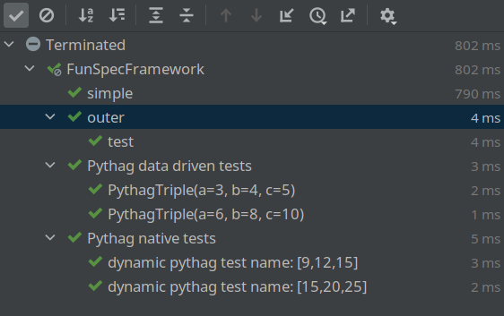

## Test Framework
* nested [Testing Styles](https://kotest.io/docs/framework/testing-styles.html)
* Data Driven Tests
* [Extensions](https://kotest.io/docs/extensions/extensions.html), e.g.
  - TestContainer
  - Spring
  - JUnit XML Reporter
* native Coroutine / async-testing support

[//]: # (* annotation-less test configuration)
[//]: # (* TestContext:  <em>`testCase.description.name`</em>)

---

## Test Framework - Styles

| Test Style	                                            | Inspired By                     | 
|--------------------------------------------------------|---------------------------------|
| Fun Spec*      <!-- .element: class="highlight" -->    | ScalaTest                       |
| Describe Spec  <!-- .element: class="highlight" -->    | Javascript frameworks and RSpec | 
| Should Spec                                            | A Kotest original               |
| String Spec                                            | A Kotest original               |
| Behavior Spec   <!-- .element: class="highlight" -->   | BDD frameworks                  |
| Free Spec   <!-- .element: class="highlight" -->       | ScalaTest                       |
| Word Spec                                              | ScalaTest                       |
| Feature Spec   <!-- .element: class="highlight" -->    | Cucumber                        |
| Expect Spec                                            | A Kotest original               |
| Annotation Spec*  <!-- .element: class="highlight" --> | JUnit                           |

<!-- .element: style="font-size: 75%;" -->
---

## Test Framework - Styles

```kotlin [1-2]
class AnnotationSpecExample : AnnotationSpec() {
  @Test
  fun test1() {
    // no nested tests !
  }
}
```
```kotlin [1-2,4]
class FreeSpecExampleTest : FreeSpec({
  "top level context" - {
    "a nested context" - {
      "a test" { // no '-' !!!
      }
    }
  }
})
```
---

## Test Framework - Styles

```kotlin [:1-4]
class BehaviorSpecExample : BehaviorSpec({
  given("a given") {
    `when`("a when must be backticked: keyword in kotlin") {
      then("a then") { 
          
      }
      then("a then with config").config(enabled = false) {
        // test here
      }}}})
```

```kotlin [1-3]
private class DescribeSpecExample : DescribeSpec({
  describe("some thing") {
    it("test name") {
      // test here
    }}})
```

```kotlin [1-3]
class FeatureSpecExample : FeatureSpec({
  feature("a top level feature") {
    scenario("some scenario") {
      1.shouldBeLessThan(4)
    }}})
```
---
## Test Framework - Config

```kotlin[1-2|4-5|9-10|11-13]
class FunSpecFramework : FunSpec() { init {
  test("simple"){ 1 shouldBe 1}
  
  context("outer") {
    test("test") { } 
  }
  
  test("disabled test")
    .config(
      enabledIf = { env("somevalue") != null },
      // object MyIntegrationTest : Tag()
      tags = setOf(MyIntegrationTest)
      // gradle test -Dkotest.tags="MyIntegrationTest & !OtherTag"
    ) { fail("oops") }}
```
---
## Test Framework - Data Driven

```kotlin[2-5|12-13]
  context("Pythag triples tests") {
    withData(
      PythagTriple(3, 4, 5),
      PythagTriple(6, 8, 10),
    ) { (a, b, c) -> isPythagTriple(a, b, c) shouldBe true }
  }
  
  context("Pythag native tests") {
    listOf(
      PythagTriple(9, 12, 15),
      PythagTriple(15, 20, 25),
    ).forEach { (a, b, c) ->
      test("dynamic pythag test name: [$a,$b,$c]") { 
        isPythagTriple(a, b, c) shouldBe true }}}
```



---
## Test Framework - Extensions

```kotlin [:1-5]
class KotestConfig: AbstractProjectConfig() {
  override fun extensions(): List<Extension> = listOf(
    // before/after callbacks, constructor injection,
    // TestContext(Manager)
    SpringExtension, 
    JunitXmlReporter(), // nested test support
    HtmlReporter()  
  )
  //  override val failOnEmptyTestSuite = true
}
```

```kotlin [:1-4]
@SpringBootTest
@AutoConfigureMockMvc
class HomeControllerKotest(
  @Autowired private val mockMvc: MockMvc
) : FreeSpec({ /* ... */ })
```
---
## Test Framework - Non-deterministic
```kotlin[2,3|6|10,11|14,15]
test("eventually") {
  eventually(duration = 1.seconds) {
    now().nano % 10 shouldBe 0
  }}
test("until as guard") {
  until(fast) { now().nano % 10 == 0 } // equivalent to eventually
  /* ... */ 
}
test("retry up to 10 times") {
  retry(10, timeout = slow) {
    now().nano % 10 shouldBe 0
  }}
test("passes for 3 seconds") {
  continually(3.seconds) {
    now().nano % 9999 shouldNotBe 0
  }}
```
<!-- .element class="stretch" -->
